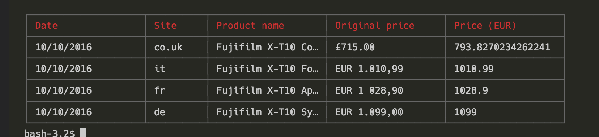

# Amazon scraper

A price scraper for amazon website powered by [Node.JS](https://nodejs.org/en/) [x-ray](https://github.com/lapwinglabs/x-ray) Promises and passion.

[Try it out!](https://runkit.com/pmcalabrese/runkit-npm-amazon-scraper)



## Install

You need to have [Node.JS](https://nodejs.org/en/) installed;

Clone the repo and run and from main folder run

`npm install amazon-scraper --save`

Use `config.json` for set the URL of the product and which amazon domains you want to scrape.

A price scraper for *Amazon website* ( .co.uk, .it and .de). It generates a table of prices for the same product in the terminal. If prices are not in Euro they will be converted in Euro (for now only pound for amazon.co.uk website is supported)

## How to use it

Create a `config.json` file with the Amazon product_url and the amazon websites domain (www.amazon.de, www.amazon.it, www.amazon.co.uk, www.amazon.fr)

`config.json`
```json
{
    "product_url": "/Fujifilm-Systemkamera-Fujinon-Objektiv-Megapixel/dp/B00XW693XE/ref=sr_1_3?ie=UTF8&qid=1476031611&sr=8-3&keywords=fuji+xt10",
    "lang": ["de", "it", "co.uk", "fr"]
}
```

Create an amazon scraper passing the config object, the `amazon_scraper` has two methods:

**scraper** : a promise that return data

**printTable** : an helper function for display data in a table in the command line

`index.js`
```javascript
const AmazonScraper = require('amazon-scraper')
const config = require('./config.json')

const amazon_scraper = AmazonScraper(config);

amazon_scraper.scraper.then(function(data) {
    amazon_scraper.printTable(data)
});
```

You can find this code in the [example](https://github.com/pmcalabrese/amazon-scraper/tree/master/example) folder in the repo.
